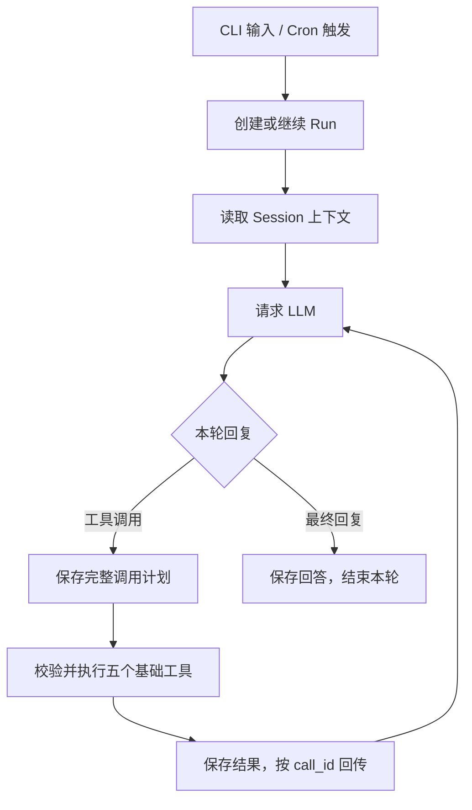

这版可以定为：**单个 Rust 程序 `komo`，Gateway 统一管理会话、执行和 cron；LLM 只使用五个基础工具，可复用能力保存成 Python 代码。**

下面是合并这五项改动后的设计，按全新项目考虑。

**1. 一个程序，两种运行形态**

```text
komo
 └─ 聊天客户端
      ├─ 检查本机 Gateway
      ├─ 未运行 → 启动并等待就绪
      └─ HTTP / SSE 连接 Gateway

komo gateway
 └─ 后台常驻服务
      ├─ Agent Runtime
      ├─ Session Store
      ├─ Tool Executor
      └─ Cron Scheduler
```

拟定命令：

| 命令 | 行为 |
|---|---|
| `komo` | 确保 Gateway 运行，然后打开新聊天 |
| `komo resume SESSION_ID` | 恢复指定会话 |
| `komo session list` | 查看历史会话 |
| `komo gateway` | 启动后台服务，就绪后返回 |
| `komo gateway --foreground` | 前台运行，供服务管理器和调试使用 |
| `komo gateway status/stop/restart` | 管理后台服务 |
| `komo cron …` | 管理定时任务 |

Fedora 使用 systemd，macOS 使用 launchd 管理后台进程。启动时用实例锁避免多个 CLI 同时拉起多个 Gateway，并通过健康检查确认服务可用。

**CLI 只负责交互，数据库、模型连接和工具执行全部属于 Gateway。** NAS 与 Mac 仍各自独立运行。

**2. 模型始终只看到五个工具**

| 工具 | 核心能力 |
|---|---|
| `read` | 读取文件，支持范围和输出限制 |
| `write` | 创建或完整写入文件 |
| `edit` | 精确修改，检查原内容是否变化 |
| `shell` | 执行命令，支持超时、取消和输出收集 |
| `python` | 执行 Python，调用保存下来的 Python 模块 |

搜索文件、访问 HTTP、操作 Git、控制 HA，都通过这些基础能力组合完成。

Python 首版采用**独立子进程执行每次调用**，使用 Gateway 管理的虚拟环境。每次返回：

```text
执行状态 + result + stdout + stderr + 产物引用
```

这样脚本出错可以独立结束，更新模块后下一次调用就能加载新代码。跨调用需要保留的数据写入文件；Python 内存变量不作为持久状态。

保存下来的工具可以采用普通 Python 模块：

```text
~/.komo/
├── toolbox/
│   ├── __init__.py
│   ├── README.md
│   ├── ha.py
│   ├── web_search.py
│   └── tests/
├── python-env/
├── workspace/
├── records/
└── artifacts/
```

模型先用 `read` 查看使用说明，再通过 `python` 调用：

```python
from toolbox import ha

result = ha.turn_off("light.living_room")
```

这里的 `ha` 是保存的代码，**不会额外注册成模型可见的第六个工具**。

AI 迭代这些能力的流程是：

```text
读取现有模块
  → 编写修改候选
  → 运行测试
  → 验证通过后替换模块
  → 保存版本和验证结果
```

每次 Python 调用记录实际使用的模块版本或内容哈希。旧代码保留快照，方便回滚和解释历史执行结果。依赖变更单独安装并锁定，避免每次调用临时安装不同版本。

**3. Agent Loop 保持通用**



Runtime 不区分 HA、记事或代码任务。它只理解：

- 用户输入与模型回复。
- 工具调用及其结果。
- 运行预算、取消、暂停和完成。
- 工作目录及执行权限。

普通追问可以直接作为模型回复结束本轮，用户回答后继续同一 Session。需要在工具执行前等待确认时，由执行器保存待处理状态。

`shell` 和 `python` 都属于本机代码执行能力。工作目录用来组织任务，不能被当成完整的操作系统沙箱。

**4. Cron 使用同一个 Agent Runtime**

Cron 只负责“到时间提交一次运行”，执行过程复用现有 Agent Loop。

```text
Cron 到期
  → 创建独立 Session / Run
  → 执行配置中的指令
  → 保存过程、结果和产物
  → 更新本次触发状态
```

例如：

```bash
komo cron add \
  --name morning-summary \
  --schedule "0 9 * * *" \
  --timezone Asia/Shanghai \
  --prompt "搜索今天关注的技术动态，整理后保存到 records"
```

模型需要创建定时任务时，也可以通过 `shell` 调用这些命令，无须增加 cron tool。

每个 Cron Job 保存：

| 字段 | 含义 |
|---|---|
| `schedule`、`timezone` | 触发时间 |
| `prompt` | 交给 Agent 的任务 |
| `workspace` | 工作目录 |
| `enabled` | 是否启用 |
| 执行预算 | 最长执行时间、模型轮数等 |
| 重叠策略 | 上次仍未完成时如何处理 |

第一版建议：

- 同一个 Job 上次仍在运行时，跳过本次并记录原因。
- 服务停机期间错过的触发不集中补跑。
- 每次触发用 `job_id + scheduled_at` 唯一标识，避免重复创建运行。
- 需要用户处理时保留会话，可以用 `komo resume` 接手。

Cron 触发去重只能避免重复提交；外部操作是否已经发生，仍按工具执行记录判断。

**5. Session 存储围绕恢复设计**

这里建议明确三个对象：

| 对象 | 职责 |
|---|---|
| **Session** | 一段持续对话，以及关联的工作目录和上下文 |
| **Run** | 一次用户输入或一次 Cron 触发产生的执行 |
| **ToolCall** | 一次具体工具调用，具有独立执行状态 |

一个 Session 可以包含多个 Run，一个 Run 可以经过多轮 LLM 和工具调用。

存储使用一个 SQLite 数据库：

| 数据 | 保存内容 |
|---|---|
| `sessions` | 会话元信息、工作目录、当前运行、最新序号 |
| `runs` | 输入、状态、预算、执行位置 |
| `events` | 按顺序追加的用户消息、完整模型回复、工具执行事件 |
| `tool_calls` | 调用参数、执行状态、结果、代码版本 |
| `checkpoints` | 上下文和执行位置的可重建检查点 |
| `cron_jobs` | 定时任务定义 |
| `cron_firings` | 触发时间及关联 Session / Run |

**优化的重点是追加新信息，避免每一轮重写整段会话。**

- 模型请求保存上下文引用和配置，不重复保存完整历史。
- 完整模型回复和工具结果到达后批量写入，不逐 token 写数据库。
- 大文件和长输出放到产物目录，数据库保存引用与有界摘要。
- 每个完整步骤更新检查点；恢复时读取检查点之后的事件。
- 检查点是缓存，失效后可以从事件重建。
- 运行状态、工具状态和对应事件在同一个数据库事务中更新。

工具调用必须采用下面的写入顺序：

```text
planned：调用计划已保存
   ↓
started：即将执行，先保存状态
   ↓
执行真实操作
   ↓
completed / failed：保存结果
```

`resume` 据此决定如何继续：

| 恢复时的状态 | 行为 |
|---|---|
| 工具已完成 | 使用保存的结果，不再次执行 |
| 已计划、尚未开始 | 可以继续执行 |
| 执行已开始，但没有结果 | 标为结果不明，先核对 |
| 等待用户处理 | 展示原问题或待确认操作 |
| 上一轮已经结束 | 恢复历史，等待下一条输入 |

**Python 首版恢复到工具调用之间，不恢复到脚本内部某一行。** 如果脚本已经产生部分副作用后中断，不能简单重跑整个脚本。复杂脚本可以主动保存阶段性进度，但这是脚本明确实现的能力。

`komo resume SESSION_ID` 因而包含两种自然行为：有未完成 Run 时接续处理；会话空闲时加载历史并继续聊天。

最终项目结构可以保持如下规模：

```text
src/
├── main.rs          # 唯一入口：komo
├── cli.rs
├── gateway.rs
├── protocol.rs
├── agent.rs
├── session.rs
├── store.rs
├── cron.rs
├── llm.rs
├── config.rs
└── tools/
    ├── mod.rs
    ├── read.rs
    ├── write.rs
    ├── edit.rs
    ├── shell.rs
    └── python.rs
```

建议实现顺序是：**Gateway 自动启动与聊天 → Session 持久化与 resume → 五个工具 → Python 工具保存与迭代 → Cron**。调用状态和恢复约束从第一版存储开始落实。
