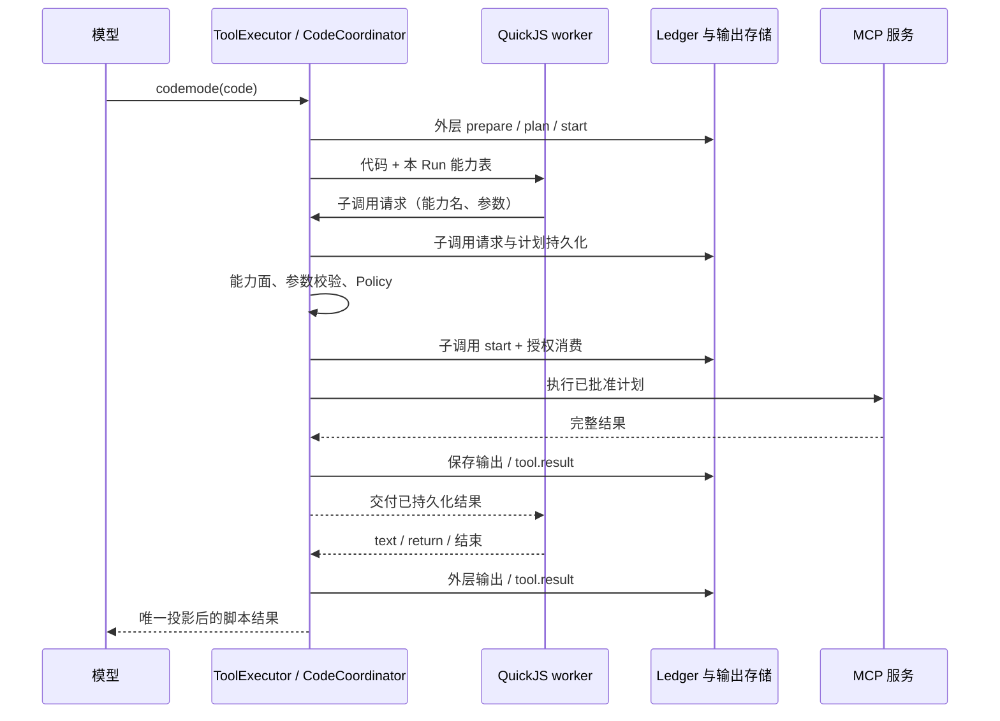

# MCP 与 codemode 接入方案

> 状态：设计草案，待确认。日期：2026-10-08。
> 本文提出对 `docs/komo_bot.md` 的变更，不覆盖当前正式设计，也不表示已经实现。
> 对照 pi 提交：`1cedd32724abfcb0915f76cc61b6827e2c16dbad`。

## 1. 要解决的问题

komo 已有 Python、toolbox、统一 ToolExecutor 与结果存储，但缺少两种能力：

- 接入现成 MCP 服务，而不用为每个服务编写一个 toolbox 模块。
- 在一次模型调用中串联、并发和过滤工具结果，避免所有中间数据反复进入模型上下文。

例如“查询失败订单，读取每笔支付状态，统计失败金额”：模型负责生成一段组合代码；
代码调用订单与支付能力，最后只返回统计和异常 ID。每次远端调用仍独立授权、落账。

方案采用三层：**能力目录 → 统一执行器 → 隔离的组合代码**。
MCP 是能力来源；codemode 是组合入口；Python 保留现有计算、文件处理与 toolbox 职责。

## 2. 关键决定

| 问题 | 本方案的选择 |
|---|---|
| MCP 的实现位置 | runtime 实现连接与工具适配，Gateway 组装并管理生命周期 |
| 模型是否看全部 MCP schema | 默认不看；通过目录与说明按需发现 |
| codemode 用什么语言 | JavaScript，QuickJS；独立受管理 worker 进程 |
| 是否复用任意 Python 作为隔离执行 | 不复用；当前 Python 可直接访问文件与网络 |
| 内层调用如何执行 | 进入 ToolExecutor 的同一条单调用流水线，不能直接调用 MCP client |
| 内层结果是否保存 | 完整保存；只是不默认投影成模型的独立 tool 消息 |
| 任意脚本能否在审批后恢复内存 | 首版不支持；停止原脚本，执行已批准调用，交模型写下一段 |
| Gateway 重启后是否从头重跑脚本 | 不重跑；先恢复子调用，再生成中断结果 |
| 第一版调用范围 | native `read` / `rg`，以及操作者明确配置为只读的 MCP 工具 |
| 首版持久化脚本变量 | 不提供 `store/load`；已有结果与产物引用承担续写所需状态 |

这是增加一个明确的组合入口 `codemode`，不是给每个 MCP 工具增加一个常驻模型 schema。
批准本方案后，必须同步修改正式设计的“六个基础工具”限制与“MCP 不在首版”范围。

## 3. 当前基础与需要修改的边界

| 当前事实 | 位置 | 本方案如何使用 |
|---|---|---|
| Run 冻结 `AgentSurface` | `komo-kernel/src/types/agent.rs` | 继续作为能力授权上限 |
| schema 与可执行工具来自同一集合 | `komo-gateway/src/service/segment.rs` | 改为同一能力目录的两个投影 |
| `tool://` 提供说明和 schema | `komo-runtime/src/tools/resources.rs` | 扩展为按需发现入口 |
| 统一 prepare、Policy、审批、执行、落账 | `komo-runtime/src/executor/mod.rs` | 外层和每个子调用都复用 |
| Python 每次调用独立进程 | `komo-runtime/src/python_runtime/` | 保持现状，不在里面增加隐式 MCP 连接 |
| 工具模型视图只有一处投影 | `komo-kernel/src/projection.rs` | codemode 最终结果仍走同一投影 |
| 恢复原请求依赖 assistant 事件 | `komo-gateway/src/service/segment.rs` | 子调用改从自己的请求事件恢复 |

pi 值得借鉴的是 callable 与 declared 分开、按需说明、内层统一调用，以及完整结果交给
脚本处理。不能照搬它的恢复模型：pi 的内层完整结果不单独持久化，只在外层结果记录有限
调用摘要；komo 的子调用需要完整执行事实和结果引用。

## 4. 能力目录与授权

### 4.1 能力集合

```text
registered   Gateway 当前知道哪些能力
     │ AgentProfile 的显式选择 + Run 快照
     ▼
authorized   本 Run 最多允许调用哪些能力（AgentSurface）
     │ exposure 与实际可用状态
     ├── declared   直接给模型的 native tool schema
     └── callable   codemode 可以调用的能力
```

`declared ⊆ authorized`，`callable ⊆ authorized`。目录搜索只能返回 authorized 中的
能力。隐藏一个 schema 不等于撤权；猜中一个名字也不等于获得调用权。

所有入口再次核对能力面、当前停用状态与 Policy。内层调用继承父 Run 的来源、principal、
cwd、资源根和配置快照，不能把 Cron 变成交互来源，不能从全局目录补上未授权工具。

### 4.2 Exposure

首版只提供三个值，避免同时实现两种延迟加载机制：

| 值 | 模型声明 | codemode 调用 | 目录可见 |
|---|---|---|---|
| `direct` | 是 | 在 codemode 支持范围内可以 | 是 |
| `code` | 否 | 可以 | 是 |
| `hidden` | 否 | 否 | 否 |

MCP 默认 `code`；native 工具维持现有直接调用。首版不增加 `tool_search` 模型工具，
不实现 pi 的 `only` 模式，不强制模型把简单 read/edit 包成脚本。

模型/脚本名使用 `mcp__<server>__<tool>` 的规范化标识；非法字符与超长名称采用确定性的
哈希后缀处理碰撞。目录保留原 server/tool，并在计划中绑定原名称与映射指纹；
不能因为 `a-b` 和 `a_b` 规范化后相同就把两个不同能力合成一个授权对象。

### 4.3 Run 快照与动态服务

- Gateway 在加载配置后后台连接服务、取得工具目录；故障只影响对应服务。
- 冻结 Run 时只等待该 Profile 显式选择的服务，使用有界等待；暂定上限 5 秒。
- 成功服务的工具名、schema、说明、endpoint/启动配置指纹和权限覆盖外置成目录快照。
  未就绪服务记录 unavailable，能力面中不放入其工具；下一条 Run 可使用后续连接结果。
- 不等待未选择服务，不在运行中因 `tools/list_changed` 扩大本 Run 的能力。
- 已有 Run 仍使用原目录说明；执行前检查当前服务配置与工具契约是否匹配。
  不匹配返回版本冲突，提示需要新 Run 使用新目录，不把新工具悄悄替换进旧计划。
- 当前禁用、撤权与显式 Deny 立即生效。配置快照不能维持已撤销的权限。

工具契约指纹只能检测已知的 schema、说明和配置变化，不能证明远端实现没有变更。
因此 MCP 的写操作默认没有可靠恢复方式，不能凭指纹推导“可以重试”。

## 5. 模型看到的接口

### 5.1 按需发现

保留 `read` 入口，并扩展已有资源语义：

```text
read("tool://")                         本 Run 可发现能力的摘要
read("tool://catalog/<snapshot>/<offset>") 下一页目录（由上一页 next_uri 返回）
read("tool://mcp__orders__list/schema")  参数 schema、结果约定与脚本调用签名
read("tool://mcp__orders__list/doc")     工具说明
```

目录摘要有固定字节预算和分页游标，包含 native 工具和所选 MCP 服务的摘要。
`catalog` 是资源解析器的保留分支，游标必须对应本 Run 的目录快照；跨快照或跨 Session
引用在 prepare 拒绝。分页只改变读取位置，不改变 authorized 集合。
大目录的查询放在 codemode 的 `search_tools(query, namespace?, limit?)` 中。
首版按名称、描述、namespace 做确定性的词项排名，复用已有检索设施能满足时才引入 BM25；
不增加独立索引服务。描述查询返回 schema，不把整个目录展开成执行入口的描述。

codemode 提供：

```javascript
const matches = await search_tools("失败订单", { namespace: "orders", limit: 5 });
text(matches);
text(await describe_tool("mcp__orders__list"));
```

这些辅助函数只返回本 Run 目录快照的内容，没有网络权限，也不能直接执行工具。
MCP 服务 instructions 是外部说明数据，不提升为授权或覆盖系统指令。

### 5.2 组合执行

```javascript
const response = await tools.mcp__orders__list({ status: "failed" });
if (response.isError) throw new Error("订单查询失败");
const orders = response.structuredContent.orders;

const payments = await Promise.allSettled(
  orders.slice(0, 20).map(order => tools.mcp__payments__get({ order_id: order.id }))
);
text(payments.map((result, index) => ({ order_id: orders[index].id, result })));
```

模型入口为 `codemode({ code })`。首版使用普通 JSON tool 参数，各 LLM 适配器都能接；
raw source grammar 是后续优化，不作为功能依赖。

脚本是 async 函数体，支持 `await`、`return`、`text(value)`、`exit()`。
不提供 `process`、文件系统、网络、模块加载、计时器、凭证或 Gateway HTTP token。
不能调用另一个 codemode，也不能调用 delegate/dispatch/follow 等编排入口。

MCP 调用返回 `{ content, structuredContent?, isError? }`；服务返回的业务错误保留为
结构化结果。参数错误、能力面拒绝与明确 Policy Deny 则拒绝该 Promise。
审批与 uncertain 不是可捕获的普通错误：宿主会关闭整个脚本的调用入口。

## 6. 执行器与 worker

### 6.1 调用链



codemode 是编排操作：与已有 delegate 类似，在 executor 中授权后分流到
`CodeCoordinator`，不让普通 `Tool::execute` 获得全局执行器或存储句柄。

把现有执行器的单调用流程收口为一个内部入口；模型调用与脚本子调用使用相同流程。
公共入口接收宿主生成的调用身份与环境；模型参数不能生成 Proof、来源或恢复方式。

新增 `Operation::CodeCompose` 与 `Operation::McpCall { server, tool }`。
外层 CodeCompose 只授权运行组合代码，不授权任何子动作。外层计划绑定代码哈希、worker
版本、目录快照和预算；每个 McpCall 绑定参数、服务配置/契约指纹与凭证引用。

### 6.2 Worker

QuickJS 原生引擎运行在独立 worker 进程；Gateway 按现有进程登记与回收规则管理它。
bin 仅解析内部启动命令并调用 runtime，执行逻辑仍在 runtime。

- 用专用帧协议传子调用与回复，普通脚本输出不参与控制协议解析。
- worker 只获得能力描述和宿主桥，不获得 MCP client、凭证或通用文件/网络宿主函数。
- 宿主为子调用分配真实 UUIDv7；拒绝重复消息 ID、无匹配回复和非法帧。
- 取消、超时、输出超限或审批屏障关闭入口，再中断 VM 并回收 worker 进程组。
- VM 结束不表示宿主请求已经撤销；所有在途子调用必须按真实结果落账。

新增测试接缝 `CodeHost` 与 `CodeBridge` 放 kernel；runtime 提供真实实现，测试用假宿主。
`McpHost` 同样放 kernel，协议与 transport 的具体类型只留 runtime。
CodeCoordinator 是一个具体实现，不另外增加 Coordinator trait 或插件框架。

引擎选型先做最小验证：QuickJS 的 Rust 包装、内存限制、死循环中断、跨平台交付与冷编成本。
没有这些证据不合入依赖；不因 pi 使用 WASM 就给 komo 引入完整 WASM runtime。

### 6.3 预算与并发

| 预算 | 草案默认值 | 约束 |
|---|---|---|
| VM 内存 | 64 MiB | 引擎堆限制；worker 进程内存另外测量 |
| 脚本活动时限 | 120 秒 | 取配置与 Run 调用上限的较小值，模型不能提升 |
| 子调用数 | 64 | 包含失败调用；重启不重置 |
| 已持久化完整结果交付脚本的单次上限 | 4 MiB | 超限交付结果引用，不能先截断再声称完整 |
| 脚本输出 | 1 MiB | 流式保存；超过后关闭入口并终止脚本 |
| 只读并发 | 4 | 复用 executor 预算，不另建无限 Promise 执行队列 |
| 模型最终正文 | 现有 `model_result_bytes` | kernel 唯一投影负责 |

只有本地可信策略确认的读取可以并发；不能直接使用服务自报 `readOnlyHint`。
写入、审批、核对、取消都为屏障。首版不开放写入，但执行器结构保留屏障语义。

完整结果上限不是 HTTP 响应读取上限。transport 另设有界响应大小（草案 32 MiB），
避免收到大响应后才在 JS 层限制内存；可接受结果先存储，再按 4 MiB 预算决定是否交付值。
超过 transport 上限时保留已有输出并明确标记不完整。可能已执行的远端动作进入核对，
不能把“结果太大”变成一次可自动重试的业务失败。

## 7. MCP 接入

首版实现 stdio 与 Streamable HTTP、工具列表、工具调用、progress 和 list_changed。
不实现旧 SSE transport、MCP Apps、prompts、OAuth 或 resource templates。
resources 的查询/读取在后续阶段用独立受授权能力接入；本期 `tool://` 仍只读取本地目录。

stdio 的 command 是单个可执行文件，args 独立配置，不解释成 shell 字符串。
cwd 来自显式配置；使用 workspace 相对目录时，连接实例按 `(配置指纹, 真实 cwd)` 隔离，
不能让两个不同 workspace 共用一个依赖 cwd 的服务进程。

HTTP 的连接池可以复用，但 Session 相关 MCP 协议状态与 roots 按配置、workspace 隔离。
发送 roots 只是一项协议声明，不是对远端或本地服务的沙箱授权。

凭证由 Gateway 的受保护配置解析，配置里只记录 `.env` 名称；值不进计划、事件、schema
或 worker。首版不支持 pi 的 `!command` 凭证解析，不自动安装 npx/uvx 依赖。

连接可以退避重试；普通 `tools/call` 不因超时、429、5xx、断线自动重试。
只有明确在发送前失败才记为未执行；请求可能已发出且没有可信结论时记 uncertain。
`isError` 表示服务报告该调用失败，不代表可以安全重复写操作。

首版 MCP 恢复方式由本地配置选择 `ReadAgain` 或 `NoSafeRecovery`。
后续需要写入去重或核对时，使用专门的已审核适配器绑定实际幂等键/核对逻辑，
不能把服务 annotation 自动转成 RecoveryMode。

## 8. 审批、脚本中断与恢复

### 8.1 首版采用分段继续，不恢复任意脚本

假设未来开放写入，脚本依次执行 A、B、C；A 已完成，B 需要审批：

1. B 的请求、参数与计划先持久化，但不 start、不执行。
2. 关闭外层调用入口。已启动调用收尾；排队但未准入的调用全部不再执行。
3. 终止 worker，保存原脚本中断记录与已有输出，然后创建 B 的审批并 suspend Run。
   审批发布与挂起使用现有 ApprovalGate 顺序，不让提前回答落入空窗。
4. 批准后只处理 B 的原计划，校验当前授权与版本，消费原审批一次。
5. B 得到明确结果后，结束外层 codemode，返回 A/B 的事实与原脚本已终止的说明。
   C 不执行；模型据此生成下一段新代码。

拒绝则 B 不执行，原脚本以中断结果收尾。取消 Run 则取消待审批与后续执行；不让批准
一条旧卡片复活已取消任务。审批期间的时间不计入活动执行时限。

`code.interrupted` 先持久化 B 的待审批意图，ApprovalGate 按子调用 ID 与计划哈希幂等
建立请求。若中断记录已写、审批事务尚未提交就重启，恢复该意图建立一次请求；
若审批已存在则直接复用。不能把这个窗口里的 B 当成普通排队调用放弃，或者重新 prepare。

这意味着首版没有“批准后从原来的 await 下一行继续”的承诺。该限制体现在工具说明和
审批界面，不能让模型以为批准后 C 已经执行。

### 8.2 外层结果格式

```json
{
  "script_status": "interrupted",
  "reason": "approval_boundary",
  "continuation": "new_script",
  "output_ref": "<已保存的脚本输出引用>",
  "calls_ref": "<完整子调用清单引用>",
  "settled_calls": [
    {"call_id": "A", "status": "completed", "output_ref": "<A 的结果>"},
    {"call_id": "B", "status": "completed", "output_ref": "<B 的结果>"}
  ]
}
```

`script_status` 是结果正文的字段，取 `completed / failed / interrupted`，不新增一套
Run 状态。完整脚本才写外层 `ToolResultStatus::Completed`；失败或已确定终止且没有
未知子结果的脚本写 `Failed`，作为工具结果交给模型。任何未决副作用都先停在 intervention，
不能用外层 `Failed` 掩盖它。

模型摘要只列有限数量调用并给完整清单引用；存储中的清单和子结果不按摘要预算丢弃。
获批 B 的正文只进入本次外层中断结果的预览；其完整结果仍保存在 B 自己的输出中。

### 8.3 重启恢复表

| 已持久化事实 | 恢复动作 |
|---|---|
| 外层尚未 start | 可以首次启动 worker |
| 外层已 start、尚无子调用 | 不重跑代码，生成 `gateway_restart` 中断结果 |
| 子请求存在但没有准入/计划 | 标记未执行，不在恢复时自动启动它 |
| 子计划已存在、尚未 start | 只恢复已指定的待审批调用；其他队列调用随原脚本终止 |
| 子调用 completed/failed，结果校验通过 | 复用完整事实，不执行 |
| 子调用 started，没有可信结果 | 按该子计划的恢复方式核对；未知则 intervention |
| 外层在等待审批 | 恢复原审批和 B 的原计划；不重新运行脚本或创建第二张审批 |
| 所有子调用已确定，但外层未收尾 | 生成中断结果；不伪造原 return 值或丢失的文本 |
| 外层结果文件完整，事件尚未提交 | 校验身份、计划与哈希后按 §8.5 补结果事件 |
| 任一结果引用损坏 | 停止受影响 Run；不重跑以掩盖损坏 |

外层采用编排专用恢复分支，依据我们自己的调用账本收口。它不宣称任意 JS 可以安全重做。
已确定的事实与丢失的脚本内存分开处理，无法恢复的内存交给模型在下一段重新构造。

## 9. 存储、事件与回放

复用 Session 的 `payloads/`、`tool-output/` 和 `artifacts/`，不增加另一份事实数据库。

- 新增 `tool.child_requested`：父调用、子调用 UUID、顺序、能力名、参数引用与代码来源。
  请求正文先写外部 payload，再 append + sync，最后建立 DB 派生索引。
- 每个已准入子调用仍使用 `tool.planned / tool.started / tool.result` 和 `tool_attempts`。
- 新增 `code.interrupted`：中断原因、待审批子调用（如有）与已保存输出引用。
- `tool_calls` 加可空 `parent_call_id`、`request_event`、`child_ordinal`；旧调用默认为根。
  子调用的 `provider_call_id` 写空串，不伪造模型发出的 provider ID。
- 外层代码、目录快照与调用清单外置；JSONL 保持 ≤1 KiB 行预算。

恢复时，Gateway 只把根调用交回模型轮次执行器；CodeCoordinator 从父子关联恢复子调用。
不能沿用当前“从 assistant 消息找每个请求”的路径，否则子调用会被漏掉或错误当成
模型调用。fold、open_calls 查询和历史组装都必须识别父子关系。

模型历史中只配对外层 codemode 的 provider call ID；内层结果不会变成没有对应 assistant
调用的独立 tool 消息。调用树、完整输出和审批记录仍可在客户端查看。

子结果必须完成文件持久化、`tool.result` 和 DB 提交之后才回复 worker。
VM 正常输出流式保存为外层输出事实；控制日志和普通输出分开。结束后的 `body.preview`
由 runtime 根据已保存事实生成，kernel `projection.rs` 唯一负责模型视图。

新增列按仓库 additive migration 规则实施：更新 model 旁 DDL、parity test、file DB
pool 建立前迁移；不重写旧 JSONL。引入新执行语义时加最低兼容版本检查，旧 Gateway
不能把未知子调用事件当作无事发生后继续运行相同状态目录。

## 10. 配置与操作者接口

以下 TOML 为待实现的配置形状，不是当前已经可执行的配置：

```toml
[codemode]
enabled = false                       # 默认关闭，阶段验收后由操作者启用
timeout_secs = 120
memory_bytes = 67108864
max_calls = 64
max_result_bytes = 4194304
max_output_bytes = 1048576

[mcp.servers.orders]
transport = "http"
url = "https://orders.example/mcp"
authorization_env = "ORDERS_AUTH"     # .env 的完整 Authorization 值
enabled = true
exposure = "code"
description = "订单与支付查询"
timeout_secs = 60

[mcp.servers.orders.tools.list]
access = "read"                       # 操作者声明，仍须 Policy 放行

[mcp.servers.orders.tools.create]
exposure = "hidden"

[agents.assistant]
tools = ["read", "write", "edit", "rg", "shell", "python", "codemode"]
mcp_servers = ["orders"]              # 缺省 []；不会因启用服务扩张全部 Agent
```

native `tools` 的现有选择语义保留；MCP 使用显式 `mcp_servers`，避免现有 tools 缺省
意味着全部 native 的行为意外带入全部远端工具。server 工具默认 `access = unknown`，
首版无法经 codemode 调用，必须由操作者明确选择；服务 annotations 只用于展示。

配置解析与校验在 runtime，类型在 kernel。Policy 增加 server、MCP 原工具名、endpoint
和操作类别匹配；说明中的 access 不生成 Proof。CodeCompose 的默认规则只允许已启用的
隔离执行，子动作仍按原来源与当前策略独立决定。

配置热重载按完整快照校验后原子替换；新连接先准备再给新 Run 使用。安全停用立即阻止
新准入并取消相关在途请求，在途结果仍需核对。worker 后端与引擎安装路径属于 start-only，
必须报告需要重启；运行参数采用 Run 快照，审批续跑不能偷偷换代码或服务配置。

CLI 全部通过 Gateway HTTP/SSE：

```text
komo mcp list             服务状态、连接错误、能力数与有效 exposure
komo mcp probe SERVER     连接与列目录；不调用业务工具
komo mcp reconnect SERVER 重建连接；不重试未决业务动作
```

首版配置直接编辑 config.toml，用 `komo config check/reload`；不另做配置写入命令。
审批卡片展示 `server/tool`、参数摘要、endpoint、父脚本与代码哈希，授权仍绑定子计划。
TUI/SSE 展示外层脚本下的调用树；同一 `read` 能力读取完整结果，无客户端直接开 DB 路径。

## 11. Crate 分工与预期改动

| Crate | 内容 |
|---|---|
| kernel | 目录快照/暴露类型、父子调用值类型、新 Operation/事件、fold 与 projection；所有新 trait |
| store | 子请求外置与事件、父子索引、输出发布、additive migration；不理解 QuickJS/MCP transport |
| runtime | `catalog/`、`mcp/`、`codemode/`；单调用流水线、CodeCoordinator、worker、Policy 匹配 |
| agent | 按授权目录渲染服务摘要、codemode 用法和 skills 能力门控；不连接 MCP 或执行代码 |
| gateway | 连接与 worker 组装、快照准备、CLI API、配置生命周期、审批/结果投递 |
| client | 服务状态与调用树显示、命令输出，依赖 kernel 协议类型 |
| bin | clap 分发，包括内部 worker 启动分发，无执行器或协议实现 |

runtime 仍不依赖 agent；agent 仍只依赖 kernel。首版使用 feature `mcp` 与 `codemode`
隔离新增依赖，默认不开启；相应 feature 构建、冷编与重复依赖分别记录。

## 12. 实施阶段与验收

| 阶段 | 交付 | 必须通过的验收 |
|---|---|---|
| 0：技术验证 | QuickJS worker 与 MCP transport 最小样例；不开放给模型 | 死循环可杀、内存超限可收口、进程组回收；stdio/HTTP 两种连接；记录冷编、包大小与依赖归因 |
| 1：目录 | 授权/声明/可调用分离、目录快照、tool:// 与查询辅助 | 未授权名字、hidden 和子代理禁用能力不可发现/不可调用；服务新增工具不扩张已有 Run |
| 2：MCP | stdio/HTTP、只读适配、明确请求状态、完整结果存储 | 未 plan/start 不发请求；服务失败隔离；契约变化拒绝旧计划；断线不会重复业务调用 |
| 3：codemode 读取 | CodeCoordinator、worker bridge、子事件、只读并发、审批中断、唯一结果投影 | 并发受限；每个子调用有完整账本；只读 Ask 可挂起并分段继续；无网络/文件宿主接口；重启不重跑原脚本；实时与回放逐字节一致 |
| 4：审批与写入 | 分段继续、write/edit 与经配置选择的 MCP 写操作 | A 完成/B 待批/C 未执行；重启与重复回答不重做 A/B；Deny 不可覆盖；未知副作用停 intervention |

阶段 3 是首版发布范围；其中只读调用也可能遇到 Ask，因此必须实现 §8 的审批中断协议。
阶段 4 不是补一个 allow 开关：必须补齐写屏障、取消/断线核对和恢复验收后才能开放。
任意 shell/Python 经 codemode 组合、跨调用 store/load、自动脚本重放、OAuth 与 MCP
resources 是后续独立范围，不随阶段 4 自动开放。

必要故障注入：

- 远端已执行、结果丢失；结果文件已发布、事件未写；事件已同步、DB 未提交。
- 子结果已提交、回复 worker 丢失；worker 结束、外层结果尚未提交。
- A 已完成，B 等审批时杀 Gateway；批准后执行 B 再杀 Gateway；拒绝/取消/重复回答。
- 显式 Deny、服务停用、契约变化、凭证撤销、能力面外猜名与伪造 bridge 帧。
- 输出超限、巨大 MCP 响应、死循环、并发取消、不同 workspace 的 stdio cwd 隔离。

每阶段运行 `cargo test --workspace`、`cargo fmt --check`、`cargo tree -d` 和
`cargo build --timings`，按 feature 归因重复依赖，并将实际结果写回正式设计 §13.4/§14。
真实服务验证单列：假 MCP 服务测试不能作为实际认证、服务兼容或生产恢复的证据。

## 13. 批准后需要回写的正式设计

- §3：MCP CLI/API 与热重载/start-only 项。
- §4：增加 codemode 组合入口；schema 与授权集合的两个投影；子调用流水线。
- §4 的资源命名空间：扩展 tool:// 目录、签名与分页预算。
- §5：Python 职责保持；与隔离组合执行的分工。
- §6/§7：脚本预算、屏障、McpCall、CodeCompose 和每子调用的计划审批。
- §8：父子事件、内容顺序、分段审批继续、外层编排恢复和版本兼容门禁。
- §13.3/§13.4：配置、新依赖/feature、冷编与交付影响。
- §14：上述分阶段验收与未验证项。

## 14. pi 源码依据

以下链接固定到本次核对提交，避免后续 main 改动影响方案依据：

- [MCP exposure 与配置](https://github.com/earendil-works/pi/blob/1cedd32724abfcb0915f76cc61b6827e2c16dbad/packages/coding-agent/docs/mcp.md)。
- [codemode 隔离、完整结果与发现接口](https://github.com/earendil-works/pi/blob/1cedd32724abfcb0915f76cc61b6827e2c16dbad/packages/coding-agent/docs/codemode.md)。
- [脚本执行与 ctx.executeTool](https://github.com/earendil-works/pi/blob/1cedd32724abfcb0915f76cc61b6827e2c16dbad/packages/coding-agent/src/extensions/codemode/execute.ts)。
- [真实 Session 的内层校验/hook 入口](https://github.com/earendil-works/pi/blob/1cedd32724abfcb0915f76cc61b6827e2c16dbad/packages/coding-agent/src/core/agent-session.ts)。
- [内层摘要及结果不单独持久化](https://github.com/earendil-works/pi/blob/1cedd32724abfcb0915f76cc61b6827e2c16dbad/packages/coding-agent/src/core/nested-tool-calls.ts)。
- [MCP 完整结构化结果与模型截断分离](https://github.com/earendil-works/pi/blob/1cedd32724abfcb0915f76cc61b6827e2c16dbad/packages/coding-agent/src/extensions/mcp/tools.ts)。
- [QuickJS host 的中断和在途请求取消](https://github.com/earendil-works/pi/blob/1cedd32724abfcb0915f76cc61b6827e2c16dbad/packages/codemode/src/runtime/host.ts)。
